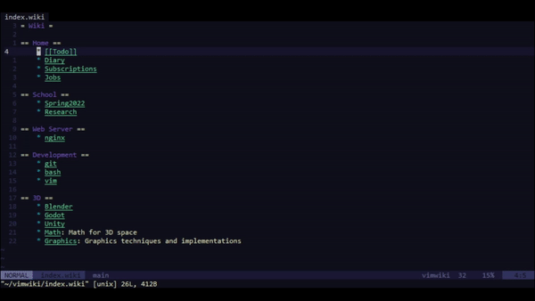

# miniterm.vim :bookmark:
- Simple Vim9 toggle-terminal manager



## :hammer: Installation
:warning: Only supported for vim >= 8.2, not nvim

Install using Vim's builtin plugin manager:
```sh
mkdir -p ~/.vim/pack/bundle/start
git clone https://github.com/hahdookin/miniterm.vim ~/.vim/pack/bundle/start/miniterm.vim
```

## :alembic: Usage
- `<leader>tt` -- Toggle current terminal window on/off
- `<leader>tn` -- Create new current terminal
- `<leader>th` -- Make previous terminal current
- `<leader>tl` -- Make next terminal current
- `<leader>td` -- Delete current terminal
- `<leader>tq` -- Delete all terminals

---

## :framed_picture: Screenshots / Images

## :memo: Rationale
This plugin is part of a plugin suite designed to achieve the functionality of modern IDEs without external dependencies or bloat. Plugins in this suite are meant to be small, extensible, and powerful. 

--- 
